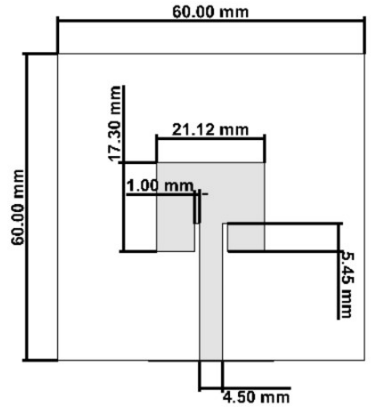
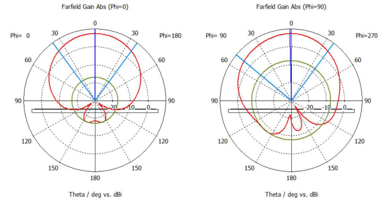
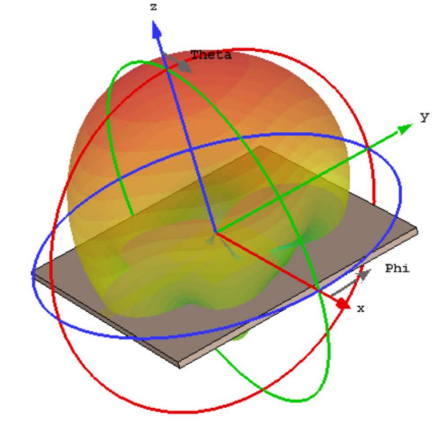

# Diseño y Simulación de Antena Patch para 5.8 GHz

Este proyecto consiste en el diseño, modelado y simulación de una antena de microcinta (patch) con polarización circular, optimizada para operar en la banda de 5.8 GHz. Fue desarrollado para la materia **Antenas y Propagación** (Optativa) en la UNRN (2024).

## Especificaciones Técnicas
- **Frecuencia Central:** 5.8 GHz.
- **Sustrato:** Sustrato Rogers RT5880LZ con permitividad relativa $\epsilon_r = 2.2$ y espesor de 1.5 mm.
- **Polarización:** Lineal.

## Resultados de la Simulación
Tras el proceso de optimización en **CST Studio Suite**, se obtuvieron los siguientes parámetros:
- **Coeficiente de Reflexión ($S_{11}$):** -49.57 dB en la frecuencia de resonancia.
- **Ganancia:** 7.36 dBi.
- **Directividad** 8.03 dBi.
- **Eficiencia (Rad.)** -0.68 dB. 

## Herramientas Utilizadas
- **CST Studio Suite:** Modelado 3D, configuración de puertos y simulación electromagnética.
- **Cálculo Analítico:** Dimensionamiento inicial basado en las propiedades del sustrato.

## Documentación
El datasheet completo con los diagramas de radiación (2D y 3D) y las gráficas de fase se encuentra en la carpeta `/datasheet`.

